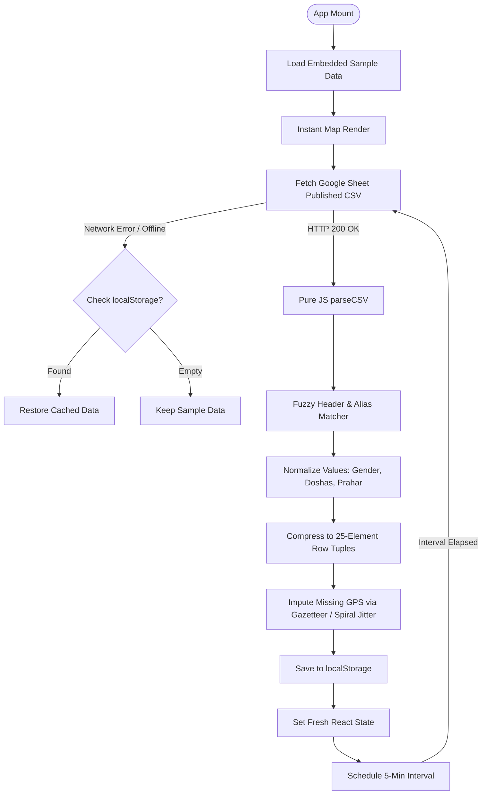

# Nadi Tarangini — India Device Heatmap React Application
> **Technical Architecture & System Documentation**  
> **Last Verified:** 2026-09-04 | **Production URL:** https://livedatant.vercel.app/

---

## ⚠️ CRITICAL NOTICE FOR AGENTS: NO GIT REPOSITORY

> [!CAUTION]
> **THIS PROJECT IS NOT TRACKED IN GIT.**  
> - **DO NOT run ANY git commands** (`git status`, `git diff`, `git commit`, `git add`, `git push`, `git checkout`, etc.).
> - Running git commands will fail or trigger permission denial errors from the user.
> - Work directly on the local filesystem in `c:\Users\User\Downloads\Aditya_data\live_data_react\`.
> - Changes are tracked manually via `agent.md` (Update Log) and deployment releases on Vercel.

---

## 1. Project Overview

The **Nadi Tarangini India Device Intelligence Map** is a real-time geographic data visualization dashboard built for **Atreya Innovations**. It visualizes pulse diagnostic metrics gathered from Nadi Tarangini hardware devices deployed across India.

### Key Capabilities:
- **Continuous Weather-Style Heatmap:** Instead of standard discrete heat bubbles or point clusters, the dashboard computes an Inverse Distance Weighted (IDW) field rendered onto an HTML5 `<canvas>` and strictly clipped to the official polygon boundaries of India via `Path2D`.
- **Live Google Sheet Sync:** Ingests live device diagnostic data directly from a published Google Sheet CSV endpoint every 5 minutes without requiring user interaction.
- **Robust Offline Fallback:** Implements a three-tier data recovery strategy: Live Sheet Fetch &rarr; `localStorage` Cache &rarr; Embedded Sample Data.
- **Multi-Dimensional Clinical Filtering:** Supports multi-select filtering across Age brackets, Ayurvedic Prahar (time of day), BMI categories, State, Country/Scope, and Ayurvedic doshas/clinical indications.

---

## 2. Tech Stack & Dependencies

| Layer | Technology | Version | Purpose / Notes |
|---|---|---|---|
| **Core Framework** | React | `^19.2.8` | Component lifecycle, state orchestration, memoization |
| **DOM Renderer** | React-DOM | `^19.2.8` | Virtual DOM rendering |
| **Build Tool / Dev Server** | Vite | `^8.2.2` | HMR development, ES module bundling, tree-shaking |
| **Linting** | Oxlint | `^1.79.0` | High-speed Rust-based JavaScript/React linter |
| **Geographic Mapping** | Leaflet | `^1.9.4` | Base tile rendering (OpenStreetMap) & custom pane layering |
| **Map Extension** | Leaflet.heat | `0.2.0` | Loaded via CDN for fallback layer support |
| **Styling** | Vanilla CSS | CSS3 | Custom theme tokens, dark maroon (`#5A1530`) palette, responsive flex/grid |
| **Hosting & CDN** | Vercel | Production | Static build deployment (`livedatant.vercel.app`) |

---

## 3. Project Directory Architecture

```
live_data_react/
├── .env                          # Environment variables (Sheet CSV URL, refresh period)
├── .env.example                  # Template of required environment variables
├── index.html                    # Single-page entry; loads Leaflet CSS/JS CDN dependencies
├── package.json                  # Dependencies (React 19, Leaflet, Vite) and npm scripts
├── package-lock.json             # Locked dependency tree
├── vercel.json                   # Vercel deployment build & rewrite configuration
├── vite.config.js                # Vite React plugin setup
├── .oxlintrc.json                # Oxlint rules configuration
├── agent.md                      # LIVING AGENT RUNBOOK & OPERATIONAL LOG
├── work.md                       # THIS ARCHITECTURAL & TECHNICAL SPECIFICATION
├── public/                       # Static public assets
└── src/
    ├── main.jsx                  # React application entry point (root mount)
    ├── App.jsx                   # Master state coordinator, filter pipeline, ErrorBoundary
    ├── index.css                 # Complete responsive CSS design system
    │
    ├── constants/
    │   ├── config.js             # Environment variable readers, refresh intervals, cache keys
    │   ├── indiaGeo.js           # Full GeoJSON geometry for all Indian States (~113 KB)
    │   ├── paramDefs.js          # Metric definitions (continuous & categorical), column schema IDX
    │   ├── cityData.js           # Major Indian cities gazetteer, coordinates, tiers, regional map
    │   ├── sampleData.js         # Embedded sample dataset for instant cold-start render (~340 KB)
    │   └── symptoms.js           # 22+ Ayurvedic symptom classification dictionary
    │
    ├── utils/
    │   ├── colorUtils.js         # Logarithmic scale normalization and color palette interpolation
    │   ├── dataBuilder.js        # Transforms parsed record objects into indexed memory arrays
    │   ├── dataParser.js         # Legacy workbook parser & utility helpers
    │   ├── filterUtils.js        # Multi-factor row filtration (Age, Prahar, BMI, State, Country)
    │   ├── geoUtils.js           # Indian polygon point-in-polygon tests, nearest city, coordinate imputation
    │   ├── kernelInterp.js       # IDW interpolation engine, regional weighting, canvas border mask
    │   └── reportCard.js         # Formats rich clinical summary cards for map tooltips
    │
    ├── hooks/
    │   └── useGoogleSheet.js     # Live fetch engine, pure JS CSV parser, cache & auto-refresh interval
    │
    └── components/
        ├── Header.jsx            # Top navigation bar with branding & device intelligence tag
        ├── Controls.jsx          # Primary filter toolbar & dynamic category selector
        ├── MultiSelect.jsx       # Reusable checkbox-based multi-option dropdown
        ├── DataStatus.jsx        # Connectivity & sync status indicator banner
        ├── StatsRow.jsx          # Five reactive KPI cards reflecting active filter results
        ├── Footer.jsx            # Application footer with reading counts and copyright
        ├── MapPanel/
        │   ├── MapPanel.jsx      # Map container wrapper with dynamic title & zoom counter
        │   ├── HeatMap.jsx       # Leaflet map instance, canvas layering, and lifecycle binding
        │   └── Legend.jsx        # Parameter color scale legend (continuous gradient or category pills)
        └── LowerGrid/
            ├── LowerGrid.jsx     # Responsive two-column grid wrapper
            ├── StateRanking.jsx  # Top 10 states ranking table with relative percentage bars
            └── Glossary.jsx      # Interactive tabbed glossary defining vitals and Ayurvedic metrics
```

---

## 4. Data Pipeline & Storage Schema

### 4.1 Ingestion Flow (`src/hooks/useGoogleSheet.js`)



### 4.2 Why Pure JS CSV Parsing?
In earlier revisions, CSV parsing relied on SheetJS (`window.XLSX`) loaded from a CDN. On slow networks or Vercel production cold-starts, React initialized before the CDN script was parsed, throwing `XLSX not defined` and causing blank screens.
- **Current Solution:** `useGoogleSheet.js` contains a self-contained, high-performance CSV line & quote parser (`parseCSV`) with zero external runtime dependencies.

### 4.3 Compact Memory Row Schema (`IDX`)
To optimize performance for thousands of patient records, rows are stored as memory-efficient indexed arrays:

```javascript
// Defined in src/constants/paramDefs.js
export const IDX = {
  lat: 0,              // Latitude (Float or null)
  lon: 1,              // Longitude (Float or null)
  state: 2,            // State Index (maps into data.states)
  city: 3,             // City Index (maps into data.cities)
  age: 4,              // Patient Age (Integer)
  height_cm: 5,        // Height in cm (Float)
  weight_kg: 6,        // Weight in kg (Float)
  bmi: 7,              // Body Mass Index (Float)
  gender: 8,           // Gender Index (0: Female, 1: Male, 2: Other)
  pulse: 9,            // Pulse Rate in bpm (Float)
  rhythm: 10,          // Pulse Rhythm Index (0: Irregular, 1: Regular)
  sama_nirama: 11,     // Sama/Nirama Index (0: Nirama, 1: Sama)
  manda_vegawati: 12,  // Manda/Vegawati Index (0: Manda, 1: Vegawati)
  bala_pct: 13,        // Bala Pulse Strength (0 - 100%)
  agni_pct: 14,        // Agni Digestive Fire (0 - 100%)
  virkriti: 15,        // Current Dosha Imbalance Index (maps into data.doshaLabels)
  prakriti: 16,        // Inherent Constitution Index (maps into data.doshaLabels)
  issue: 17,           // Classified Clinical Symptom Index (maps into data.issues)
  medical_id: 18,      // Diagnostic Reading Medical ID
  patient_id: 19,      // Patient Identifier
  doctor_id: 20,       // Doctor Identifier
  date: 21,            // Reading Date string (YYYY-MM-DD)
  time: 22,            // Reading Time string (HH:MM AM/PM)
  country: 23,         // Country Index (maps into data.countries)
  approx: 24           // Geolocation flag (0: Exact GPS, 1: Imputed Approximation)
};
```

---

## 5. Geospatial & Weather-Field Interpolation Algorithm

### 5.1 Inverse Distance Weighting (IDW) Engine (`src/utils/kernelInterp.js`)
The visualization renders an continuous environmental field rather than individual pins:

1. **Spatial Aggregation (`fieldSamples`):**
   - The map viewport is segmented into grid cells whose degree resolution scales with zoom (`cellDeg = Math.max(0.18, 1.4 - zoom * 0.10)`).
   - Points falling into each cell are aggregated into sample centroids with mean values and regional tallies.
2. **Context-Aware Distance Weighting (`idwAt`):**
   - For every target pixel on the canvas, Euclidean squared distance $d^2 = \Delta\text{lat}^2 + \Delta\text{lon}^2$ is calculated against all active samples.
   - Base weight: $W_i = \frac{N_i}{d^2 + 0.09}$.
   - **Regional Heuristic:** If sample $i$ belongs to the same cultural/geographic region of India (North, South, East, West, Central, Northeast) as the nearest major city, its weight is **boosted by $2.0\times$**.
   - **City-Tier Heuristic:** If sample $i$ matches the urban tier (Tier 1 metro vs Tier 2/3), weight is **boosted by up to $1.8\times$**.
3. **Bilinear Upscaling:**
   - Instead of evaluating IDW at every screen pixel (which would freeze the browser), a low-resolution grid ($GW \times GH$, between $40 \times 40$ and $190 \times 190$) is computed into a small offscreen canvas.
   - The small canvas is painted onto the display canvas with `ctx.imageSmoothingEnabled = true` and `imageSmoothingQuality = 'high'`, producing smooth Gaussian-like transitions.
4. **Geometric Border Clipping:**
   - A `Path2D` polygon path is constructed from all features in `INDIA_STATES_GEO`.
   - The canvas context clips the interpolated field using:
     ```javascript
     ctx.globalCompositeOperation = 'destination-in';
     ctx.drawImage(mask, 0, 0);
     ctx.globalCompositeOperation = 'source-over';
     ```
   - This ensures not a single pixel bleeds outside Indian borders into the oceans or neighboring territories.

### 5.2 Missing GPS Imputation (`src/utils/geoUtils.js`)
When records lack hardware GPS coordinates or match known erroneous GPS flags:
1. **Cascade Fallback:**
   - Direct City Average &rarr; City Gazetteer lookup (`cityData.js`) &rarr; State Average &rarr; State Polygon Centroid (`STATE_POLY_CENTROID`).
2. **Golden-Angle Spiral Jitter:**
   - Prevents visual stacking of hundreds of readings on a single point:
     $$\theta = (i \cdot 2.399963) \pmod{2\pi}, \quad r = \text{spread} \cdot \sqrt{(i \cdot 0.618034) \pmod 1}$$
     $$\text{lat}_{\text{new}} = \text{lat}_0 + r \cdot \sin(\theta), \quad \text{lon}_{\text{new}} = \text{lon}_0 + r \cdot \cos(\theta)$$
   - Marks `r[IDX.approx] = 1`.

---

## 6. Multi-Factor Filtration Architecture

Filtration is managed reactively via `getFilteredRows()` in `src/utils/filterUtils.js`:

| Filter Dimension | Mechanism & Details |
|---|---|
| **Parameter Selector** | Switches between continuous metrics (Pulse, Bala, Agni, Age, BMI) and categorical metrics (Prakriti, Virkriti, Major Issue). |
| **Category to Map** | Appears dynamically when a categorical parameter is active; displays sorted list of categories with reading frequencies. |
| **State Filter** | Filters by State name (`data.states`). |
| **Data Scope** | Filters by Country name (`data.countries`). |
| **Age Category** | Multi-select brackets: Child (0–17), Young Adult (18–35), Adult (36–60), Senior (61+). |
| **Prahar (Time of Day)** | Parses `time` string into minutes since midnight and evaluates against 6 traditional Ayurvedic windows: <br>• *Pratah* (6–9 AM, 360–540m)<br>• *Sanghava* (9–12 PM, 540–720m)<br>• *Madhyahna* (12–3 PM, 720–900m)<br>• *Aparahna* (3–6 PM, 900–1080m)<br>• *Sayahna* (6–9 PM, 1080–1260m)<br>• *Night* (9 PM–6 AM, 1260–360m wraps midnight) |
| **BMI Category** | Multi-select: Underweight (<18.5), Normal (18.5–24.9), Overweight (25–29.9), Obese (30+). |

---

## 7. Leaflet Map Pane Management

To prevent tile layers, state boundaries, and the canvas overlay from conflicting:
- `statesPane` (z-index 300): Base state polygons.
- `interpPane` (z-index 350): Houses the dynamic HTML5 weather-field `<canvas>`.
- `bordersPane` (z-index 380): Indian state boundary borders drawn in `#5A1530` maroon with zero fill opacity so the weather field shines through underneath.

---

## 8. Development & Deployment SOP

### 8.1 Local Environment
```bash
# 1. Enter project directory
cd live_data_react

# 2. Install dependencies
npm install

# 3. Start development server with HMR
npm run dev
# Server boots at http://localhost:5173
```

### 8.2 Production Build Verification
Before deploying, ALWAYS verify that the build succeeds with zero errors:
```bash
npm run build
# Expected output:
# dist/index.html
# dist/assets/index-[hash].css
# dist/assets/index-[hash].js
```

### 8.3 Vercel Deployment
```bash
# Deploy to Vercel production
npx vercel --prod --yes

# If domain aliasing is required:
npx vercel alias <deployment-url> livedatant.vercel.app
```

---

## 9. Historical Gotchas & Troubleshooting

1. **Uncaught ReferenceError: DOSHA_COLORS is not defined**
   - *Cause:* `PARAM_DEFS` in `src/constants/paramDefs.js` referenced `DOSHA_COLORS` before its declaration.
   - *Fix:* Ensure color arrays are declared prior to `PARAM_DEFS` array construction.
2. **Blank Page / White Screen on Initial Mount**
   - *Cause:* Relying on `window.XLSX` from CDN when React booted before script execution.
   - *Fix:* Native JS `parseCSV` in `useGoogleSheet.js` with fallback error boundaries.
3. **Leaflet Container Already Initialized**
   - *Cause:* React 19 StrictMode remounting components.
   - *Fix:* Check `leafletMapRef.current` and properly call `map.remove()` in `useEffect` cleanup.
4. **Git Command Failures**
   - *Cause:* Trying to run `git` on an untracked local directory.
   - *Fix:* Do not run `git` commands. Track changes via `agent.md`.
